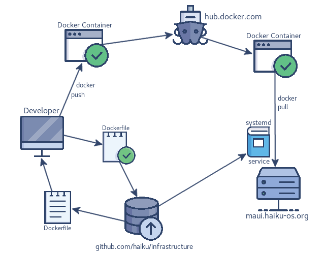

# Infrastructure as code

Treating Haiku's infrastructure as cattle instead of kittens since 2017.



## Directories

  * docs - Full documentation on Haiku's infrastructure
  * containers - Manifests to build and deploy containers
  * data - Static, git tracked files which can be bind in containers.
  * playground - Things that we're experimenting with. Not used in production.

# Quickstart

These are the path of least resistance for new admins to do "things"

## Initial Installation

  * ```make deploy```

## Container Upgrades

  * Be sure to update the relevant docker compose (this directory, .yml) with the version change.
  * Use docker service update to target an update to a single service.
    * Example: ```docker service update --image haiku/haikudepotserver:1.0.116 --force cdn_haikudepotserver```
    * Docker will pull the updated image, and force the specified service over to it.
