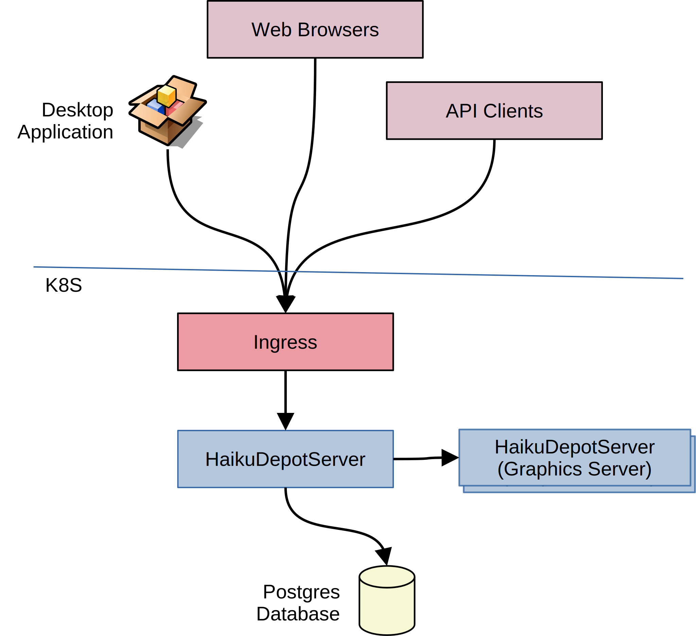

# HaikuDepotServer

## Overview



HaikuDepotServer (HDS) is an application server for managing packages' supplementary data including screenshots, icons, translations and ratings.

The HaikuDepotServer system services the following inbound HTTP traffic;

- HaikuDepot desktop application api requests
- HTML web interface requests
- Sundry API traffic from other processes and services

The HaikuDepotServer (HDS) is written in Java / SpringBoot with its state stored in a Postgres Database. Owing to the original architecture, only one instance of the HDS application server should be deployed at a time; this is a limitation to be addressed in the future.

The HaikuDepotServer Graphics Server (HDS-GS) is an ancillary application-server. The purpose of HDS-GS is to provide basic graphics operations to the main HDS application. The list of operations includes;

- Rendering [HVIF](https://blog.leahhanson.us/post/recursecenter2016/haiku_icons.html) files to PNG
- Creating thumbnails
- Scaling images
- Optimizing images

These operations are performed in HDS-GS by call-outs to various platform-supplied native binaries as well as a custom native binary tool `hvif2png`. These native binaries are carried on the HDS-GS container image together with a simple Java / SpringBoot application server to serve requests over HTTP.

The purpose of separating out the HDS-GS operations from HDS is;

- to ensure that the security of the image-handling binaries is isolated from main HDS application server; should one of the binaries be compromised then HDS and its data is somewhat isolated.
- to allow the main HDS container image to be smaller because it can be based off a slim Java-execution base container.
- to allow for independent scaling of the two services with quite different behaviors.

## Testing / verifying

### HDS-GS

To test this service, port-forward to the pod;

```
kubectl port-forward service/haikudepotserver-server-graphics 9085:8085
```

Prepare a PNG test image of dimensions approximately 1000x1000 or so.

```
curl -o output-file.png -v -X POST --data-binary @input-file.png "http://localhost:9085/__gfx/thumbnail?w=100&h=100"
```

After the `curl` command has executed, the `output-file.png` should contain a valid image proving that the HDS-GS application server is working.

## Services' source

The source code for the services' logic is stored in a [git repository](https://github.com/haiku/haikudepotserver/) where additional documentation can be found.